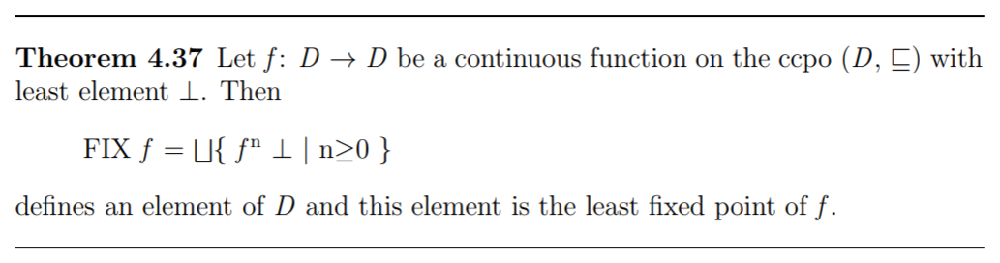
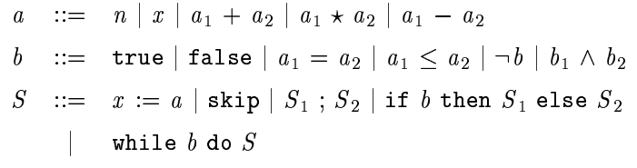

# hile

Interpreter written in Haskell for the While language described [here](http://www.cs.kun.nl/~hubbers/courses/sc_1718/materiaal/wiley.pdf). It builds the semantic function of the code and then applies it to the given state. In particular the interpreter performs a fixpoint calculation using the [Knaster–Tarski theorem](https://en.wikipedia.org/wiki/Knaster%E2%80%93Tarski_theorem) for calculating the semantics of the while construct. For further information see [this](http://www.cs.kun.nl/~hubbers/courses/sc_1718/materiaal/wiley.pdf).



To use the interpreter one may exploit the REPL function in the main or 

```
stack ghci
```

and then the function `i` to interpret one program in one given state. For example:

```
i ("y:=1; while x != 1 do y:=y*x; x:=x-1","[x->7000]")
```

computes the factorial of 7000. The grammar of the language is: 



The syntax is enriched with some syntactic sugar, always removed before interpreting the program:

| Sugar constructs       |
| :-------------: |
| for       | 
| repeat      | 
| or | 
| < |
| > |
| >= |
| != |
| ^ |

To build the executable you need [happy](https://www.haskell.org/happy/) installed, one parser generator for Haskell. To build the executable run:

```
./generateGrammar
stack build
```

To run the REPL mode use:

```
./i
```
